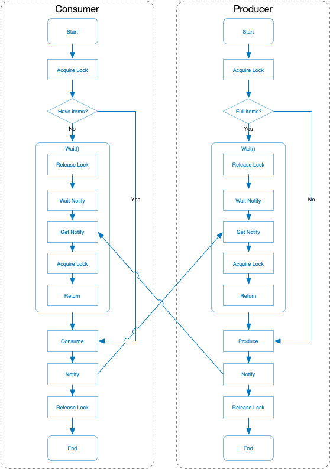

## 译者注
> 译者在这里添加一段。

乍一看这段代码好像会死锁，因为 `condition.acquire()` 之后就在 `.wait()` 了，好像会一直持有锁。

其实 `.wait()` 会将锁释放，然后等待其他线程 `.notify()` 之后会重新尝试获得锁。

但是要注意 `.notify()` 并不会自动释放锁，所以代码中有两行，先 `.notify()` 然后再 `.release()` 。

译者画了一张图，方便大家理解。这里的过程应该是这样子的（注意 `wait()` 里面实际有一个释放锁重新获得锁的过程）：



译者的私货完毕，建议看一下官方文档： [https://docs.python.org/3/library/threading.html](https://docs.python.org/3/library/threading.html) )

- 消费者通过拿到锁来修改共享的资源 `items[]` ：

```python
condition.acquire()
```

- 如果list的长度为0，那么消费者就进入等待状态：

```python
if len(items) == 0:
    condition.wait()
```

- 否则就通过 pop 操作消费一个item：

```python
items.pop()
```

- 然后，消费者的状态被通知给生产者，同时共享资源释放：

```python
condition.notify()
condition.release()
```

- 生产者拿到共享资源，然后确认缓冲队列是否已满（在我们的这个例子中，最大可以存放10个item），如果已经满了，那么生产者进入等待状态，直到被唤醒：

```python
condition.acquire()
if len(items) == 10:
    condition.wait()
```

- 如果队列没有满，就生产1个item，通知状态并释放资源：

```python
condition.notify()
condition.release()
```

> Python对条件同步的实现很有趣。如果没有已经存在的锁传给构造器的话，内部的 _Condition 会创建一个 RLock() 对象。同时，这个RLock也会通过 acquire() 和 release() 管理：

```python
class _Condition(_Verbose):
    def __init__(self, lock=None, verbose=None):
        _Verbose.__init__(self, verbose)
        if lock is None:
           lock = RLock()
        self.__lock = lock
```

> (以下又是笔者的私货，最近看到一道面试题是这样的，开3个线程按照顺序打印ABC 10次。正好是 Condition 的使用场景。我把我写的代码贴在这里供大家参考。

```python
# -*- coding: utf-8 -*-

"""
Three threads print A B C in order.
"""


from threading import Thread, Condition

condition = Condition()
current = "A"


class ThreadA(Thread):
    def run(self):
        global current
        for _ in range(10):
            with condition:
                while current != "A":
                    condition.wait()
                print("A")
                current = "B"
                condition.notify_all()


class ThreadB(Thread):
    def run(self):
        global current
        for _ in range(10):
            with condition:
                while current != "B":
                    condition.wait()
                print("B")
                current = "C"
                condition.notify_all()


class ThreadC(Thread):
    def run(self):
        global current
        for _ in range(10):
            with condition:
                while current != "C":
                    condition.wait()
                print("C")
                current = "A"
                condition.notify_all()


a = ThreadA()
b = ThreadB()
c = ThreadC()

a.start()
b.start()
c.start()

a.join()
b.join()
c.join()
```

原理很简单，就是线程拿到锁先检查是不是自己渴望的状态。比如打印“B”的线程，渴望的状态 current = 'B' 然后打印出B，将状态改成 C ，这样就成了打印“C”的线程渴望的状态。

但是这里不能唤醒指定的线程，只好唤醒所有的线程，让他们自己再检查一遍状态了。）