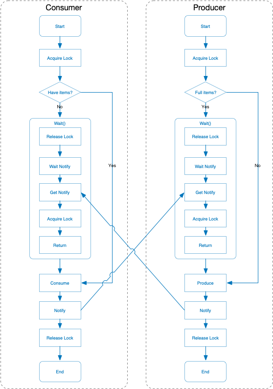

> 参见：https://python-parallel-programmning-cookbook.readthedocs.io/zh_CN/latest/chapter2/09_Thread_synchronization_with_a_condition.html


## 译者注
> 译者在这里添加一段。

乍一看这段代码好像会死锁，因为 `condition.acquire()` 之后就在 `.wait()` 了，好像会一直持有锁。

其实 `.wait()` 会将锁释放，然后等待其他线程 `.notify()` 之后会重新尝试获得锁。

但是要注意 `.notify()` 并不会自动释放锁，所以代码中有两行，先 `.notify()` 然后再 `.release()` 。

译者画了一张图，方便大家理解。这里的过程应该是这样子的（注意 `wait()` 里面实际有一个释放锁重新获得锁的过程）：



译者的私货完毕，建议看一下官方文档： [https://docs.python.org/3/library/threading.html](https://docs.python.org/3/library/threading.html) )

- 消费者通过拿到锁来修改共享的资源 `items[]` ：

```python
condition.acquire()
```

- 如果list的长度为0，那么消费者就进入等待状态：

```python
if len(items) == 0:
    condition.wait()
```

- 否则就通过 pop 操作消费一个item：

```python
items.pop()
```

- 然后，消费者的状态被通知给生产者，同时共享资源释放：

```python
condition.notify()
condition.release()
```

- 生产者拿到共享资源，然后确认缓冲队列是否已满（在我们的这个例子中，最大可以存放10个item），如果已经满了，那么生产者进入等待状态，直到被唤醒：

```python
condition.acquire()
if len(items) == 10:
    condition.wait()
```

- 如果队列没有满，就生产1个item，通知状态并释放资源：

```python
condition.notify()
condition.release()
```

> Python对条件同步的实现很有趣。如果没有已经存在的锁传给构造器的话，内部的 _Condition 会创建一个 RLock() 对象。同时，这个RLock也会通过 acquire() 和 release() 管理：

```python
class _Condition(_Verbose):
    def __init__(self, lock=None, verbose=None):
        _Verbose.__init__(self, verbose)
        if lock is None:
           lock = RLock()
        self.__lock = lock
```
